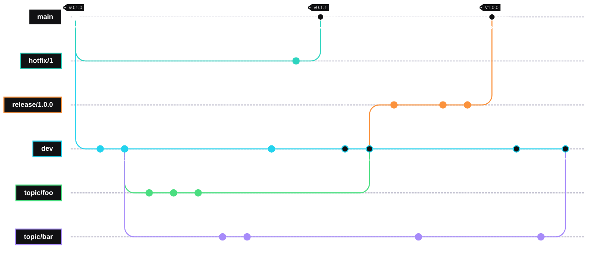
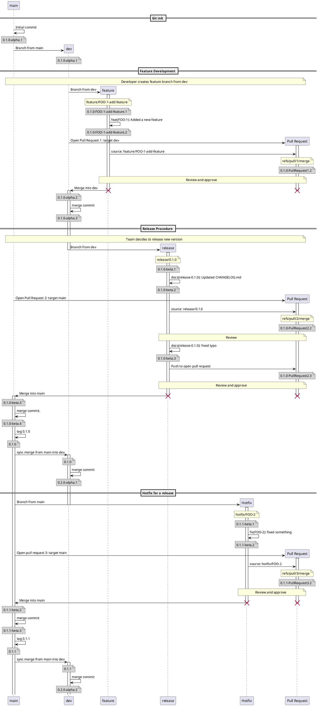

# git-semver Design Document

## Requirements

1. Simple CLI invocation
2. Configurable via git's [configuration mechanism](https://git-scm.com/docs/git#_configuration_mechanism)
3. Does not modify the repository state
4. Conforms to [Semantic Versioning 2.0.0](https://semver.org)
5. Allow explicit version overriding via tags and branch names
6. Allow explicit version incrementation via commit message trailers
7. Support [GitFlow branching strategy](https://nvie.com/posts/a-successful-git-branching-model/)
8. Installable binary

## Stretch Goals

1. Support multiple branching strategies (GitFlow, GitHub Flow, Trunk, etc.)
2. Invoke via `git describe --semver [options] [<commit-ish>...]`

## Open Questions

| ID | Topic | Notes |
| -- | ----- | ----- |
| OQ-1 | `git describe --semver` | Feasibility depends on git's extensibility model. May need to be a wrapper around `git describe` rather than a true extension of it. |
| OQ-2 | Monorepo support | Scoping version resolution to a subdirectory. Deferred to a future release. |
| OQ-3 | Conventional Commits | Automatically mapping `feat:`, `fix:`, `BREAKING CHANGE:` trailers to minor/patch/major bumps. High value but increases scope. |
| OQ-4 | Tag writing | A `git semver tag` subcommand that writes a new tag for the resolved version. Opt-in only; touches repository state. |
| OQ-5 | Additional strategies | Trunk-based development, GitHub Flow, and release-train models are the most commonly requested candidates. |
| OQ-6 | Detached HEAD classification | Should `--branch <name>` be supported to explicitly specify the branch context when HEAD is detached? |
| OQ-7 | Release branch name as version assertion | Currently treated as a hint with a warning on mismatch. Should mismatch be a hard error? |
| OQ-8 | `semver.fallbackVersion` initial bump | When no tag exists and the fallback is `0.0.0`, the default patch bump produces `0.0.1-label.N`. Should the default bump in the absence of any tag be minor instead, producing `0.1.0-label.N`, to better reflect that pre-release work is not a patch fix of nothing? |
| OQ-9 | Named capture groups in label patterns | Allowing named capture groups from the `pattern` regex to be referenced as `{name}` tokens in `prereleaseLabel`. Stretch goal. |

## Invocation

The following forms shall be supported:

- `git semver [options] [<commit-ish>]`
- `git-semver [options] [<commit-ish>]`

If `<commit-ish>` is omitted, the default is `HEAD`.

### Exit Codes

| Exit Code | Definition |
| :-------: | ---------- |
| 0 | Success |
| 1 | General Error |
| 2 | No suitable version tag found |
| 3 | Configuration Error |

## Configuration

Configuration is controlled via git's [configuration mechanism](https://git-scm.com/docs/git#_configuration_mechanism).
Keys live under the `[semver]` section and respect git's standard scope
precedence.

### Configuration Keys

| Key | Type | Default | Description |
| --- | ---- | ------- | ----------- |
| semver.strategy | string | `gitflow` | Branching strategy used when computing the version number. Currently only `gitflow` is valid. |
| semver.prefix | string | *(none)* | Prefix that version tags carry. E.g. `v` for `v1.2.3`. Set to empty string if tags carry no prefix. Accepts a regular expression. |
| semver.searchDepth | integer | `0` | Maximum number of commits to traverse when searching for a version tag. `0` means unlimited. |
| semver.tagType | string | `annotated` | Which tags are considered during baseline search. Options: `annotated`, `lightweight`, `any`. |
| semver.fallbackVersion | string | `0.0.0` | The synthetic baseline version used when no tags satisfying the pattern are found. A warning is emitted to stderr when this fallback is used. |
| semver.baselineMode | string | `nearest-stable` | Controls which tags are eligible as the version baseline. `nearest-stable` considers only tags with no pre-release component. `nearest-any` considers all matching version tags, including pre-release tags. |
| semver.incrementViaCommitMessage | bool | `false` | Whether version incrementing via commit message trailers is enabled. |
| semver.incrementMajor | string | `Version-Bump: major` | Commit message trailer that forces the major version to increment. Only used when `incrementViaCommitMessage` is `true`. |
| semver.incrementMinor | string | `Version-Bump: minor` | Commit message trailer that forces the minor version to increment. Only used when `incrementViaCommitMessage` is `true`. |
| semver.incrementPatch | string | `Version-Bump: patch` | Commit message trailer that forces the patch version to increment. Only used when `incrementViaCommitMessage` is `true`. |

### Example

```ini
[semver]
    strategy = gitflow
    prefix = [vV]
    baselineMode = nearest-stable
    tagType = annotated
```

## Semantic Versioning

All version numbers produced by `git-semver` shall conform to
[Semantic Versioning 2.0.0](https://semver.org). The format is:

```text
MAJOR.MINOR.PATCH[-pre-release][+build-metadata]
```

All version numbers match the regular expression:

```text
^(?P<major>0|[1-9]\d*)\.(?P<minor>0|[1-9]\d*)\.(?P<patch>0|[1-9]\d*)
(?:-(?P<prerelease>(?:0|[1-9]\d*|\d*[a-zA-Z-][0-9a-zA-Z-]*)
(?:\.(?:0|[1-9]\d*|\d*[a-zA-Z-][0-9a-zA-Z-]*))*))?
(?:\+(?P<buildmetadata>[0-9a-zA-Z-]+(?:\.[0-9a-zA-Z-]+)*))?$
```

### Tag Recognition

A git tag is recognized as a *version tag* if its name, after stripping the
configured prefix, matches:

```text
^(?P<major>0|[1-9]\d*)\.(?P<minor>0|[1-9]\d*)\.(?P<patch>0|[1-9]\d*)$
```

If a *version prefix* is specified in the configuration, the prefix is stripped
prior to regex comparison.

A version tag with no pre-release component denotes a *stable release*. If the
target commit is pointed to by a stable release tag, `git-semver` returns that
version verbatim, plus any configured build-metadata. Distance of zero drops the
pre-release label entirely.

## Version Precedence and Context-Dependence

A version number is not an intrinsic, permanent property of a commit. It is
always computed as a function of two things:

- the commit itself
- the branch context

The branch context is formed by which branch the `HEAD` resides when the tool is
invoked and how the order of precedence is defined by the branching strategy.
The same commit may produce different version strings when evaluated from
different contexts, on different branches. This is intentional and
consistent with how Semantic Versioning defines precedence.

For example, as a commit propagates up the GitFlow branch hierarchy, its version
evolves monotonically. Each transition to a new context produces a version with
a strictly higher semantic version precedence than any previous context.

The following shows how a single commit's version can evolve as it is reachable
in higher contexts in the GitFlow branch hierarchy:

```text
0.2.0-alpha.3     HEAD is on a feature branch, the lowest precedence context.
                  The commit is an ancestor of HEAD.

0.2.0-beta.7      HEAD is on the development branch, the next precedence context.
                  The commit is still an ancestor of HEAD in this context.
                  Therefore, the commit can be given a version with a higher
                  precedence than the previously calculated version.

1.0.0-beta.7      HEAD is on a release branch, the next precedence context above
                  the development branch. The next release version has been
                  explicitly declared 1.0.0. The commit is an ancestor of HEAD
                  in this context too, and can be given the higher version.

1.0.0-beta.7      HEAD is on main, the highest precedence context.
                  This commit is an ancestor of HEAD but is not itself tagged.
                  Therefore, it cannot be given a version that lacks a
                  pre-release label. There is a merge commit that is an ancestor
                  of HEAD, but not the commit, with the tag "1.0.0". That commit
                  has with its version lacking the pre-release label, has higher
                  precedence over this commit. This is the highest version that
                  can describe the commit, so it is its Semantic Version.
```

`git semver` computes the version of a commit as seen from the `HEAD` of the
current branch. It does not assign a permanent version number to a commit in
isolation. If a permanent, stable identifier for a specific commit is required,
release tags should be used.

## History Traversal and Topology

`git-semver` walks the commit graph backwards from the specified commit using a
two-pass approach.

### Pass 1: Baseline search (BFS)

A breadth-first search across all parents locates the nearest reachable stable
tag. BFS guarantees the nearest tag is found first. When `baselineMode = nearest-stable`,
pre-release tags encountered during traversal are noted but skipped. If multiple
stable tags are equidistant, the tag with the highest semantic version precedence
wins. If two equidistant tags carry the same version, a warning is emitted.

### Pass 2: Label Regime Classification

Once the baseline is known, the commits in the window `<baseline-tag>..HEAD`
must be classified to determine which pre-release label to apply. The
classification depends on:

- which branch `HEAD` is on
- where the commit sits relative to branch-points in the history
- the branching strategy.

If a strategy supports label regime classification, it must define how to
resolve pre-release labels.

The traversal produces the following inputs to the version resolution algorithm:

1. The *version base*: the nearest stable release tag, or `semver.fallbackVersion`
if none exists.
2. The *commit distance*: the number of commits in `git rev-list <baseline-tag>..HEAD`.
All commits in the reachable window are counted, including commits that arrived
via merged branches. No first-parent filtering is applied.
3. The set of *version-bump trailers* found in commit messages in the same
window, if `semver.incrementViaCommitMessage` is enabled.
4. The *label regime* of the target commit (which pre-release label applies).

### All Commits Are Counted

Distance counts all commits reachable from `HEAD` that are not reachable from
the baseline tag, with no first-parent filtering. This ensures every commit in
the repository has a unique, addressable version. Consider:

```text
main:    v1.0.0 ──────────────────────── M  ← HEAD
                \                        /
feature:         A ──── B ──── C ──── D
```

The commits `A`, `B`, `C`, `D`, and `M` are all reachable from `HEAD`. A user
who checks out commit `B` after this merge is on a real commit in the
repository's history and `git semver` must return a meaningful version for it.
Counting all five commits gives each a unique distance and therefore a unique
version. First-parent counting would assign them all the same distance, which
conflicts with each other.

### Baseline Mode

`nearest-stable` (the default) ensures that pre-release tags on release branches
do not become the baseline for a version calculation. In an active GitFlow
repository, `release/1.0.0` accumulates `rc` tags before it merges. If one of
those `rc` tags were used as the baseline for a commit the development branch,
the resulting version would imply that dev is building on top of a release
candidate rather than a stable release, which is misleading. `nearest-any` is
available for repositories that tag pre-release commits and want those tags to
anchor the distance counter.

### Nearest Release Tag Resolution

When multiple stable tags are equidistant from the target commit (most commonly
at a merge commit where two parent chains each lead to a different tag in the
same BFS wave), the tag with the highest semantic version precedence is
preferred. If two equidistant tags carry the same version, a warning is emitted
to stderr and the tool picks one deterministically by tag creation timestamp.
The older tag is chosen. This situation represents a repository history error.

### Commit Distance

Commit distance is the count of all commits since the baseline tag. This is
equivalent to the output of `git rev-list --count <baseline-tag>..HEAD`. All
commits in the reachable window are included.

### Trailer Search Window

When `semver.incrementViaCommitMessage = true`, commit trailers are scanned
across all commits in `git rev-list <baseline-tag>..HEAD`. The highest-precedence
bump token found in the window determines the increment behavior
(major > minor > patch). If no token is found, the default bump is minor.
Branching strategies, like `GitFlow`, may override the default behavior in
certain applicable contexts.

## Commit Trailer Conventions

`git-semver` reads *git trailer* lines from commit messages to determine version
increment behavior when `semver.incrementViaCommitMessage = true`. Trailers
follow the conventions described in
[`git interpret-trailers`](https://git-scm.com/docs/git-interpret-trailers). The
trailer must appear in the final paragraph of the commit message, separated from
the body by a blank line. Token comparison is case-insensitive and
leading/trailing whitespace is stripped.

## GitFlow Branching Strategy

When `semver.strategy = gitflow`, `git-semver` derives pre-release labels by
examining the branches that contain the target commit and classifying them by
name pattern.

### Branch Classification

Branches are classified in the following order; the first match wins:

| Classification | Default Pattern | Default Pre-Release Label |
| -------------- | --------------- | ------------------------- |
| main | `^main$\|^master$` | *(none — see below)* |
| develop | `^dev(elop(ment)?)?$` | `dev.{distance}` |
| feature / topic | `(feature\|topic)[-/].*` | `{branch}.{distance}` |
| release | `release[-/].*` | `rc.{distance}` |
| hotfix | `hotfix[-/].*` | `rc.{distance}` |
| long-term support | `support[-/].*` | *(none — see below)* |

Unmatched branch names emit a warning to stderr and fall back to feature branch
behavior.

Additional classifications expected in future releases:

- [ ] Merge/pull request references (e.g., `refs/pull/N/merge`)
- [ ] Custom user-defined classifications

### Untagged Commits on Main

The semantic version of a commit using GitFlow is:

```text
MAJOR.MINOR.PATCH-LABEL.N
```

where:

- `LABEL` is the pre-release label being deduced by the classification
- `N` is a counter, representing a distance in number of commits. `N` is defined
uniquely for each classification.

In well-disciplined GitFlow, every merge commit that is made on `main` is
immediately tagged. Untagged commits on `main` represent a tagging gap. When
`git-semver` encounters an untagged commit on `main`, it attempts to determine
the pre-release label via [GitFlow's Label Regime Classification](#gitflow-label-regime-classification).
If the pre-release label cannot be determined, the bare numeric distance since
the previous tag is used as the pre-release identifier.

```text
MAJOR.MINOR.PATCH-N
```

This is a valid Semantic Version but signals that something is anomalous.

### GitFlow Label Regime Classification

This algorithm depends on merge commits having two distinct parents. Squashed
merges and rebase merges destroy the second-parent chain and make label regime
classification impossible. GitFlow already mandates `--no-ff` merges; this is a
hard **requirement** for `git-semver` when using the GitFlow strategy.

This algorithm encodes branch provenance in the graph structure itself via
second-parent links, not in branch refs. A release branch can be safely deleted
after merging without losing the ability to classify its commits.

#### Feature Branch Classification

A commit that is on a `feature` branch, but not on the `develop` branch is
classified as a feature commit, and will be given the corresponding feature label.
The `N` counter starts at 1 after the branch-point (the merge-base of the feature
branch and its parent, the develop branch).

#### Develop Branch Classification

A commit that exists on the `develop` branch before the `release` branch is
created will carry its `develop` label even when evaluated from the `release`
branch or from `main`. This reflects its true origin. Only commits that were
made exclusively on the release branch receive the `release` label.

#### Release Candidate Branch Classification

This choice is based upon how GitFlow characterizes release candidates. The
first release candidate is the HEAD of the `develop` (or of the cherry-picked
commits from the `develop`) branch, when the release branch is created. Typically,
this state of the repository's history is the first version that undergoes final
testing before a release. Any commits made directly to the `release` branch are
fixes to the release candidate. This is unlike how `feature` branches are
considered.

Commits in the ancestry of a `release` or branch are divided into three groups
by the branch-point (the merge-base of the branch and its parent):

- **Develop-lineage commits** (before the branch-point) retain the `develop`
pre-release label, exactly as they would if evaluated from the develop branch.
They are included ancestry, not release candidates themselves. Their `N` value
is their distance from the baseline tag.
- **First release candidate commit** (at the branch-point) receives the `release`
pre-release label (e.g. `rc`). The value for `N` is 1.
- **Release-exclusive commits** (after the branch-point) receive the `release`
pre-release label. Their `N` counter starts at 2 (*first release candidate* + 1).
These commits are from the second-parent chain of the merge into `main` during a
release.

#### Hotfix Branch Classification

In practice, for `hotfix` branches in well-disciplined GitFlow, the branch-point
is always a tagged commit on `main`, so all commits on the hotfix branch are
release-exclusive. This is the same behavior as `feature` branches, so the `N`
counter start at 1 after the branch-point.

### Version Declared in Release Branch Name

A release branch name of the form `release/X.Y.Z` asserts the intended release
version. `git-semver` uses this declared version as the MAJOR.MINOR.PATCH for
commits on that branch, rather than deriving it solely from footer scanning. If
trailer scanning in the release window produces a different bump level than the
declared version implies, a warning is emitted. This is treated as a validation
hint, not an error.

### GitFlow Configuration

GitFlow-specific options reside under `[semver "GitFlow"]`. Per-category options
reside under `[semver "GitFlow.<category>"]`. Each category section may define:

| Key | Type | Default | Description |
| --- | ---- | ------- | ----------- |
| pattern | string | *(see table above)* | Regular expression matched against the branch name. |
| prereleaseLabel | string | *(see table above)* | Pattern for the pre-release label. Supports `{branch}` and `{distance}` tokens. |

The `{branch}` token is substituted with the sanitized branch suffix, which the
portion of the branch name after the configured prefix, with characters outside
`[0-9A-Za-z-]` replaced by hyphens and consecutive hyphens collapsed.

If `{distance}` is omitted from the label pattern, the distance is appended
automatically as a trailing dot-separated identifier.

**Example:**

```ini
[semver]
    strategy = gitflow

[semver "GitFlow.main"]
    pattern = main

[semver "GitFlow.develop"]
    pattern = dev
    prereleaseLabel = dev.{distance}

[semver "GitFlow.feature"]
    pattern = topic\/(?P<branch>[a-zA-Z][0-9a-zA-Z-]*)
    prereleaseLabel = {branch}.{distance}

[semver "GitFlow.release"]
    prereleaseLabel = rc.{distance}

[semver "GitFlow.hotfix"]
    prereleaseLabel = rc.{distance}
```

## Extensibility — Additional Branching Strategies

The branching strategy must be implemented behind a clearly defined interface so
that additional strategies can be added without modifying the core version
resolution logic. The interface must expose:

1. A method to classify a branch name into a logical branch type.
2. A method to derive the pre-release label given the branch type, commit
distance, and branch name.
3. A method to select the version baseline tag given the branch type and the
reachable tag set.
4. A flag indicating whether the strategy overrides trailer-derived bump levels
for specific branch types (e.g., a hotfix branch always bumps patch regardless
of footer tokens).

Strategies are registered by name and selected via `semver.strategy`.
Unrecognized strategy names produce a clear error message and exit with code 3.

The label regime classification logic (second-parent chain walk) described above
is specific to GitFlow's branch topology. Other strategies may use different
classification mechanisms. The interface must not assume this particular
algorithm.

## Git Integration

The plugin interacts with git through `libgit2` via appropriate language
bindings, or through the git CLI via subprocess calls. Direct library access via
`libgit2` is strongly preferred: it avoids shell escaping concerns, operates
correctly in detached HEAD states, and is portable across operating systems
without requiring git on `PATH`.

**Hard requirement for GitFlow:** Repositories using the GitFlow strategy must
use `--no-ff` merges. Squash merges and rebase merges destroy the second-parent
chain required for label regime classification. If the tool detects that a merge
commit in the classification window has only one parent (indicating a squash merge),
it emits a warning and falls back to treating all commits in the window as
dev-lineage.

## Output Format

By default, `git-semver` writes a single line to stdout containing the resolved
version string with a trailing newline. Errors and warnings are written to
stderr.

### Command-Line Options

| Option | Description |
| ------ | ----------- |
| `--short` | Omit pre-release and build metadata. Output only `MAJOR.MINOR.PATCH`. |
| `--json` | Output a JSON object containing all version fields and metadata (see below). |
| `--dirty [<s>]` | Append suffix `s` if the working tree has uncommitted changes. Default suffix is `-dirty`. |
| `--prefix <p>` | Override `semver.prefix` for this invocation only. |
| `--strategy <s>` | Override `semver.strategy` for this invocation only. |
| `-v, --verbose` | Print traversal details to stderr. |
| `--version` | Print the version of `git-semver` itself and exit. |
| `-h, --help` | Print usage information and exit. |

### JSON Output Schema

```json
{
  "version":       "1.0.0-rc.2",
  "major":         1,
  "minor":         0,
  "patch":         0,
  "preRelease":    "rc.2",
  "buildMeta":     "",
  "baselineTag":   "v0.1.1",
  "distance":      10,
  "branch":        "release/1.0.0",
  "branchType":    "release",
  "labelRegime":   "release-exclusive",
  "bump":          "major",
  "dirty":         false
}
```

## Corner Cases and Known Limitations

1. Rebase invalidates prior versions. If a branch is rebased, all commit SHAs
change. Previously computed version numbers are attached to dead SHAs. This is a
fundamental limitation of rebase workflows. Teams should prefer merge workflows
when using `git-semver`.

2. Distance zero drops the pre-release label. When the target commit is exactly
at a stable release tag, the version is returned verbatim with no pre-release
suffix. A distance of zero means the commit *is* the release.

3. Detached HEAD state. When HEAD is detached, there is no current branch name.
`git-semver` must fall back to examining which branches are reachable from the
detached HEAD commit and selecting the most appropriate classification. This is
an area of ambiguity; the behavior should be documented and a `--branch <name>`
or environment variable (in the case of CI) override option is considered for
future work.

4. Equidistant tags of the same version. If two different commits are tagged
with the same version and are equidistant from the target commit, the result is
undefined. A warning is emitted and one is selected deterministically. This
represents a repository tagging error.

5. Squash merges. If a squash merge is detected in the classification window,
the second-parent chain walk cannot distinguish dev-lineage commits from
release-exclusive commits. A warning is emitted and all commits in the window
are treated as dev-lineage. Teams using squash merges should be aware that
release-branch label classification will not be accurate.

6. Shallow clones. If the traversal reaches the boundary of a shallow clone
before finding a baseline tag, `git-semver` emits a warning and uses
`semver.fallbackVersion` as the baseline. The resulting version may be
incorrect. CI environments that use shallow clones should ensure sufficient
clone depth or use `git fetch --unshallow`.

7. Commits reachable from two release contexts. If a commit is reachable from
two different release branches with `rc` or higher labels (for example, if a
cherry-pick caused the same logical change to appear in both `release/1.0.0` and
`release/1.1.0`) this violates the GitFlow principle that a commit belongs to a
single release. `git-semver` emits a warning in this case. The version returned
is the one with higher semantic version precedence.

## Example Cases

### Example 1

Configuration:

```ini
[semver]
    strategy = gitflow
[semver "GitFlow.main"]
    pattern = main
[semver "GitFlow.develop"]
    pattern = dev
    prereleaseLabel = dev.{distance}
[semver "GitFlow.feature"]
    pattern = "topic\/(?P<branch>([a-zA-Z]+[0-9a-zA-Z-]*))"
    prereleaseLabel = {branch}.{distance}
[semver "GitFlow.release"]
    prereleaseLabel = rc.{distance}
[semver "GitFlow.hotfix"]
    prereleaseLabel = rc.{distance}
```

Graph:



Which is rendered as:


This example follows GitFlow strategy with merge commits. Feature, release, and
hotfix branches are deleted, when they are merged. Main and Development branches
are never deleted.

For the sake of this example, "Stable Version" refers to the version number that
would be calculated after the commit can be reached from the `dev` branch.
"Released Version" refers to the version number that would be calculated after
the commit can be reached on the `main` branch. "Candidate Version" refers to
the version number that would be calculated when the head is on a release or
hotfix branch and the commit is reachable.

For example, for commits created on branch `topic/foo`:

- the "Stable version" refers to the version numbers calculated when reachable
from `dev`
- the "candidate version" refers to the version number calculated when reachable
 from the `release`/`hotfix` branch.
- the "Released version" refers to the version numbers calculated when reachable
 from `main`.

After tag "v0.1.0" to tag "v0.1.1":

| Commit | Version on Branch | Stable Version | Candidate Version | Released Version |
| :----: | ----------------- | -------------- | ----------------- | ---------------- |
| A | - | - | - | 0.1.0 |
| B | 0.2.0-dev.1 | 0.2.0-dev.1 | - | - |
| C | 0.2.0-dev.2 | 0.2.0-dev.2 | - | - |
| D | 0.2.0-dev.3 | 0.2.0-dev.3 | - | - |
| J | 0.2.0-foo.1 | - | - | - |
| K | 0.2.0-foo.2 | - | - | - |
| L | 0.2.0-foo.3 | - | - | - |
| W | 0.2.0-bar.1 | - | - | - |
| X | 0.2.0-bar.2 | - | - | - |
| H | 0.1.1-rc.1 | - | 0.1.1-rc.1 | 0.1.1-rc.1 |
| R1 | - | - | - | 0.1.1 |

After tag "v0.1.1" to "v1.0.0:

| Commit | Version on Branch | Stable Version | Candidate Version | Released Version |
| :----: | ----------------- | -------------- | ----------------- | ---------------- |
| A | - | - | - | 0.1.1 |
| H | - | - | - | 0.1.1-rc.1 |
| R1 | - | - | - | 0.1.1 |
| M1 | - | 0.2.0-dev.1 | 1.0.0-dev.1 | 1.0.0-dev.1 |
| B | 0.2.0-dev.2 | 0.2.0-dev.2 | 1.0.0-dev.2 | 1.0.0-dev.2 |
| C | 0.2.0-dev.3 | 0.2.0-dev.3 | 1.0.0-dev.3 | 1.0.0-dev.3 |
| D | 0.2.0-dev.4 | 0.2.0-dev.4 | 1.0.0-dev.4 | 1.0.0-dev.4 |
| J | 0.2.0-foo.1 | 0.2.0-dev.5 | 1.0.0-dev.5 | 1.0.0-dev.5 |
| K | 0.2.0-foo.2 | 0.2.0-dev.6 | 1.0.0-dev.6 | 1.0.0-dev.6 |
| L | 0.2.0-foo.3 | 0.2.0-dev.7 | 1.0.0-dev.7 | 1.0.0-dev.7 |
| M2 | - | 0.2.0-dev.8 | 1.0.0-rc.1 | 1.0.0-rc.1 |
| W | 0.2.0-bar.1 | - | - | - |
| X | 0.2.0-bar.2 | - | - | - |
| Y | 0.2.0-bar.3 | - | - | - |
| Q | 1.0.0-rc.2 | - | 1.0.0-rc.2 | 1.0.0-rc.2 |
| S | 1.0.0-rc.3 | - | 1.0.0-rc.3 | 1.0.0-rc.3 |
| T | 1.0.0-rc.4 | - | 1.0.0-rc.4 | 1.0.0-rc.4 |
| R2 | - | - | - | 1.0.0 |

After tag "v1.0.0":

| Commit | Version on Branch | Stable Version | Candidate Version | Released Version |
| :----: | ----------------- | -------------- | ----------------- | ---------------- |
| A | - | - | - | 0.1.1 |
| H | - | - | - | 0.1.1-rc.1 |
| R1 | - | - | - | 0.1.1 |
| M1 | - | 1.0.0-dev.1 | - | 1.0.0-dev.1 |
| B | - | 1.0.0-dev.2 | - | 1.0.0-dev.2 |
| C | - | 1.0.0-dev.3 | - | 1.0.0-dev.3 |
| D | - | 1.0.0-dev.4 | - | 1.0.0-dev.4 |
| J | - | 1.0.0-dev.5 | - | 1.0.0-dev.5 |
| K | - | 1.0.0-dev.6 | - | 1.0.0-dev.6 |
| L | - | 1.0.0-dev.7 | - | 1.0.0-dev.7 |
| M2 | - | 1.0.0-rc.1 | 1.0.0-rc.1 | 1.0.0-rc.1 |
| W | 0.2.0-bar.1 | 1.1.0-dev.2 | - | - |
| X | 0.2.0-bar.2 | 1.1.0-dev.3 | - | - |
| Y | 0.2.0-bar.3 | 1.1.0-dev.4 | - | - |
| Q | - | 1.0.0-rc.2 | 1.0.0-rc.2 | 1.0.0-rc.2 |
| S | - | 1.0.0-rc.3 | 1.0.0-rc.3 | 1.0.0-rc.3 |
| T | - | 1.0.0-rc.4 | 1.0.0-rc.4 | 1.0.0-rc.4 |
| R2 | - | - | - | 1.0.0 |
| M3 | - | 1.1.0-dev.1 | - | - |
| Z | 0.2.0-bar.4 | 1.1.0-dev.5 | - | - |
| M4 | - | 1.0.0-dev.6 | - | - |

### Example 2

This example also follows GitFlow strategy with merge commits. Feature, release,
and hotfix branches are deleted, when they are merged. Main and Development
branches are never deleted.

Grey notes represent the resulting calculated version for a given commit.

Configuration:

```ini
[semver]
    strategy = gitflow
```

Sequence Diagram:


