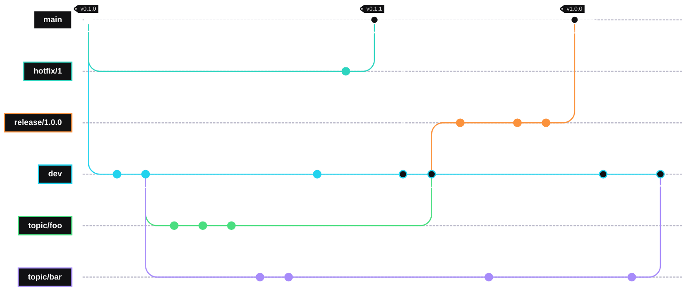

# git-semver Minimum Viable Product

## Requirements

1. Simple cli invocation
2. Configurable via git's [configuration mechanism](https://git-scm.com/docs/git#_configuration_mechanism)
3. Does not modify the repository state
4. Conforms to [Semantic Versioning 2.0.0](https://semver.org)
5. Allow explicit version overriding via tags, branch names
6. Allow explicit version incrementation via commit message (trailers)
7. Support [GitFlow branching strategy](https://nvie.com/posts/a-successful-git-branching-model/)
8. Installable binary

## Stretch Goals

1. Support multiple branching strategies (GitFlow, GitHub Flow, Trunk, etc.)
2. Invoke via `git describe --semver [options] [<commit-ish>...]`

## Invocation

The following forms should be supported:

- `git semver [options] [<commit-ish>]`
- `git-semver [options] [<commit-ish>]`

If `<commit-ish>` is omitted, the default commit-ish is `HEAD`.

### Exit Codes

| Exit Code | Definition |
| :-------: | ---------- |
| 0 | Success |
| 1 | General Error |
| 2 | No suitable version tag found |
| 3 | Configuration Error |

## Configuration

Configuration is controlled via git's
[configuration mechanism](https://git-scm.com/docs/git#_configuration_mechanism).
Keys live under `[semver]` section.

### Configuration Keys

| Key | Type | Default | Description |
| --- | ---- | ------- | ----------- |
| semver.strategy | string | gitflow | Branching strategy used when computing version number. Options are: gitflow |
| semver.prefix | string | None | Prefix pattern that version tags include. E.g. "v" is the prefix for "v1.2.3". |
| semver.searchDepth | integer | 0 (unlimited) | Maximum number of commits to traverse when searching for a version tag. 0 means unlimited. |
| semver.tagType | string | annotated | Indicates which tags are included in the base version search. Options are: annotated, lightweight, any. |
| semver.fallbackBaseVersion | string | 0.0.0 | The base version number used if no tags that satisfy the pattern are found during search. |
| semver.incrementViaCommitMessage | bool | False | Whether version incrementing is allowed via commit messages |
| semver.incrementMajor | string | "Version-Bump: major" | Commit message trailer that forces the major version number to increment. |
| semver.incrementMinor | string | "Version-Bump: minor" | Commit message trailer that forces the minor version number to increment. |
| semver.incrementPatch | string | "Version-Bump: patch" | Commit message trailer that forces the patch version number to increment. |

```ini
[semver]
    strategy = gitflow
    prefix = [vV]

```

## Semantic Versioning

All version numbers produced by git-semver shall conform to
[Semantic Versioning 2.0.0](https://semver.org). The format follows:

```text
MAJOR.MINOR.PATCH[-pre-release][+build-metadata]
```

All version numbers match the regular expression:

```text
^(?P<major>0|[1-9]\d*)\.(?P<minor>0|[1-9]\d*)\.(?P<patch>0|[1-9]\d*)(?:-(?P<prerelease>(?:0|[1-9]\d*|\d*[a-zA-Z-][0-9a-zA-Z-]*)(?:\.(?:0|[1-9]\d*|\d*[a-zA-Z-][0-9a-zA-Z-]*))*))?(?:\+(?P<buildmetadata>[0-9a-zA-Z-]+(?:\.[0-9a-zA-Z-]+)*))?$
```

### Tag recognition

A git tag is recognized as a *version tag* if its name matches the regular
expression:

```text
^(?P<major>0|[1-9]\d*)\.(?P<minor>0|[1-9]\d*)\.(?P<patch>0|[1-9]\d*)$
```

If a *version prefix* is specified in the configuration, the prefix is stripped
prior to regex comparison.

A tagged commit is determined to be a stable release if it does not include the
pre-release capture group. If the specified commit is tagged with a version tag,
`git-semver` will return the tagged version verbatim, plus any configured
build-metadata.

## History Traversal and Topology

`git-semver` walks the commit graph backwards, starting at the specified commit.
The traversal produces the following:

1. The *version base*: The semantic version with highest precedence among
reachable release tags.
2. The *commit distance*: The number of commits between the version base and the
specified commit.
3. The set of *version-bump tokens* found in commit messages between the nearest
ancestor release tag and the specified commit.
4. The set of *named references* that the specified commit is reachable from.
This is primarily branches, but may include other reference types.

### Nearest Release Tag Resolution

When multiple tags are equidistant from the target commit, the tag with the
highest precedence is preferred. If two equidistant tags have the same version,
a warning is emitted as this is undefined behavior.

### Commit Distance

Commit distance is counted as the number of commits not reachable from the
version base.

### Trailer Search Window

Commit trailers are searched and parsed across all commits reachable from the
target commit that are not reachable from the nearest release tag. This ensures
that only commits since the release are included. The increment with highest
precedence found in the window determines the increment behavior.

## Commit Trailer Conventions

`git-semver` may read *git trailer* lines from commit messages to determine
version increment behavior. Trailers are interpreted with the conventions
described in
[`git interpret-trailers`](https://git-scm.com/docs/git-interpret-trailers). The
trailer must appear in the final paragraph of the commit message, separated
from the body by a blank line.

## GitFlow Branching Strategy

When `semver.strategy = gitflow` is set, `git-semver` derives pre-release labels
by examining the branches which contain the target commit. Branches are
classified by examining their branch name. In GitFlow, branches are classified,
following [](https://nvie.com/posts/a-successful-git-branching-model/), as:

| Branch Classification | Default Pattern     | Default Pre-Release Label |
| --------------------- | ------------------- | ------------------------- |
| main                  | ^main$\|^master$    | None                      |
| develop               | ^dev(elop(ment)?)?$ | alpha.{distance}          |
| feature/topic         | feature[-/].*       | {branch}.{distance}       |
| release               | release[-/].*       | beta.{distance}           |
| hotfix                | hotfix[-/].*        | beta.{distance}           |
| supported             | support[-/].*       | None                      |

Additional classifications are expected to be added later:

[ ] Merge-request references
[ ] Supported versions
[ ] Custom Classifications

Because GitFlow is well defined in its branching strategy, we may calculate
additional information about a commit. At minimum, we will support calculating
the distance a commit is away from the merge-base between its branch, and the
branch's parent.

### GitFlow Git Configuration Options

GitFlow-specific options will reside under the `[semver "GitFlow"]` section.

Branch category specific options will reside under the `[semver "GitFlow.<category>]`
section. Each category may define the following options:

| Key | Type | Default | Description |
| --- | ---- | ------- | ----------- |
| pattern | string | \<default\> | The regular expression matching the branch name |
| prereleaseLabel | string | \<default label\> | The pattern used for the pre-release label. Variables may be used with the `{<variable-name>}` syntax. |

The allowance of using named capture groups from other configuration values in
the pre-release label is a stretch goal.

## Extensibility - Additional Branching Strategies

The branching strategy must be implemented with a clearly defined interface so
that additional strategies can be added without modifying the core version
resolution logic. The interface should expose:

1. A method to classify branch names into a logical group
2. A method to derive the pre-release label given the branch type, commit
distance, and branch name.
3. A method to select the version baseline tag given the branch type and
reachable tag set.
4. A flag indicating whether the strategy overrides trailer-derived bumping for
specific branch types.

Strategies will be registered by name and selected via the `semver.strategy`
configuration key. Unrecognized strategies names should provide a clear error
message.

## Git Integration

The plugin will interact with `git` through `libgit2` and appropriate language
bindings, or through the git command-line interface via subprocess calls. Using
direct access to the interface via a library is preferred.

## Output Format

By default, `git-semver` writes a single line to stdout containing the resolved
version string with a trailing newline. Errors and warnings are written to
stderr.

### Command-line options

| Option | Description |
| ------ | ----------- |
| --short | Omit pre-release and build metadata. Output only MAJOR.MINOR.PATCH |
| --json | Output a JSON object containing all version fields and metadata. |
| --dirty [\<s\>] | Append suffix, s, if the working tree has uncommitted changes. Default is "-dirty". |
| --prefix \<p\> | Override semver.prefix for this invocation. |
| --strategy \<s\> | Override semver.strategy for this invocation. |
| -v, --verbose | Print traversal details to stdout. |
| --version | Print the version of `git-semver` itself and exit. |
| -h, --help | Print usage information and exit |

## Example Output

### Example 1

Configuration:

```ini
[semver]
    strategy = gitflow
[semver "GitFlow.main"]
    pattern = main
[semver "GitFlow.develop]
    pattern = dev
    prereleaseLabel = dev.{distance}
[semver "GitFlow.feature"]
    pattern = "topic\/(?P<branch>([a-zA-Z]+[0-9a-zA-Z-]*))"
    prereleaseLabel = {branch}.{distance}
[semver "GitFlow.release"]
    prereleaseLabel = rc.{distance}
[semver "GitFlow.hotfix"]
    prereleaseLabel = rc.{distance}
```

Graph:




This example follows GitFlow strategy with merge commits. Feature, release, and
hotfix branches are deleted, when they are merged. Main and Development branches
are never deleted.

For the sake of this example, "Stable Version" refers to the version number that
would be calculated after the commit can be reached from the `dev` branch.
"Released Version" refers to the version number that would be calculated after
the commit can be reached on the `main` branch. "Candidate Version" refers to
the version number that would be calculated when the head is on a release or
hotfix branch and the commit is reachable.

For example, for commits created on branch `topic/foo`:

- the "Stable version" refers to the version numbers calculated when reachable
from `dev`
- the "candidate version" refers to the version number calculated when reachable
 from the `release`/`hotfix` branch.
- the "Released version" refers to the version numbers calculated when reachable
 from `main`.

After tag "v0.1.0" to tag "v0.1.1":

| Commit | Version on Branch | Stable Version | Candidate Version | Released Version |
| :----: | ----------------- | -------------- | ----------------- | ---------------- |
| A | - | - | - | 0.1.0 |
| B | 0.2.0-dev.1 | 0.2.0-dev.1 | - | - |
| C | 0.2.0-dev.2 | 0.2.0-dev.2 | - | - |
| D | 0.2.0-dev.3 | 0.2.0-dev.3 | - | - |
| J | 0.2.0-foo.1 | - | - | - |
| K | 0.2.0-foo.2 | - | - | - |
| L | 0.2.0-foo.3 | - | - | - |
| W | 0.2.0-bar.1 | - | - | - |
| X | 0.2.0-bar.2 | - | - | - |
| H | 0.1.1-rc.1 | - | 0.1.1-rc.1 | 0.1.1-rc.1 |
| R1 | - | - | - | 0.1.1 |

After tag "v0.1.1" to "v1.0.0:

| Commit | Version on Branch | Stable Version | Candidate Version | Released Version |
| :----: | ----------------- | -------------- | ----------------- | ---------------- |
| A | - | - | - | 0.1.1 |
| H | - | - | - | 0.1.1-rc.1 |
| R1 | - | - | - | 0.1.1 |
| M1 | - | 0.2.0-dev.1 | 1.0.0-dev.1 | 1.0.0-dev.1 |
| B | 0.2.0-dev.2 | 0.2.0-dev.2 | 1.0.0-dev.2 | 1.0.0-dev.2 |
| C | 0.2.0-dev.3 | 0.2.0-dev.3 | 1.0.0-dev.3 | 1.0.0-dev.3 |
| D | 0.2.0-dev.4 | 0.2.0-dev.4 | 1.0.0-dev.4 | 1.0.0-dev.4 |
| J | 0.2.0-foo.1 | 0.2.0-dev.5 | 1.0.0-dev.5 | 1.0.0-dev.5 |
| K | 0.2.0-foo.2 | 0.2.0-dev.6 | 1.0.0-dev.6 | 1.0.0-dev.6 |
| L | 0.2.0-foo.3 | 0.2.0-dev.7 | 1.0.0-dev.7 | 1.0.0-dev.7 |
| M2 | - | 0.2.0-dev.8 | 1.0.0-rc.1 | 1.0.0-rc.1 |
| W | 0.2.0-bar.1 | - | - | - |
| X | 0.2.0-bar.2 | - | - | - |
| Y | 0.2.0-bar.3 | - | - | - |
| Q | 1.0.0-rc.2 | - | 1.0.0-rc.2 | 1.0.0-rc.2 |
| S | 1.0.0-rc.3 | - | 1.0.0-rc.3 | 1.0.0-rc.3 |
| T | 1.0.0-rc.4 | - | 1.0.0-rc.4 | 1.0.0-rc.4 |
| R2 | - | - | - | 1.0.0 |

After tag "v1.0.0":

| Commit | Version on Branch | Stable Version | Candidate Version | Released Version |
| :----: | ----------------- | -------------- | ----------------- | ---------------- |
| A | - | - | - | 0.1.1 |
| H | - | - | - | 0.1.1-rc.1 |
| R1 | - | - | - | 0.1.1 |
| M1 | - | 1.0.0-dev.1 | - | 1.0.0-dev.1 |
| B | - | 1.0.0-dev.2 | - | 1.0.0-dev.2 |
| C | - | 1.0.0-dev.3 | - | 1.0.0-dev.3 |
| D | - | 1.0.0-dev.4 | - | 1.0.0-dev.4 |
| J | - | 1.0.0-dev.5 | - | 1.0.0-dev.5 |
| K | - | 1.0.0-dev.6 | - | 1.0.0-dev.6 |
| L | - | 1.0.0-dev.7 | - | 1.0.0-dev.7 |
| M2 | - | 1.0.0-rc.1 | 1.0.0-rc.1 | 1.0.0-rc.1 |
| W | 0.2.0-bar.1 | 1.1.0-dev.2 | - | - |
| X | 0.2.0-bar.2 | 1.1.0-dev.3 | - | - |
| Y | 0.2.0-bar.3 | 1.1.0-dev.4 | - | - |
| Q | - | 1.0.0-rc.2 | 1.0.0-rc.2 | 1.0.0-rc.2 |
| S | - | 1.0.0-rc.3 | 1.0.0-rc.3 | 1.0.0-rc.3 |
| T | - | 1.0.0-rc.4 | 1.0.0-rc.4 | 1.0.0-rc.4 |
| R2 | - | - | - | 1.0.0 |
| M3 | - | 1.1.0-dev.1 | - | - |
| Z | 0.2.0-bar.4 | 1.1.0-dev.5 | - | - |
| M4 | - | 1.0.0-dev.6 | - | - |

### Example 2

This example also follows GitFlow strategy with merge commits. Feature, release,
and hotfix branches are deleted, when they are merged. Main and Development
branches are never deleted.

Grey notes represent the resulting calculated version for a given commit.

Configuration:

```ini
[semver]
    strategy = gitflow
```

Sequence Diagram:


